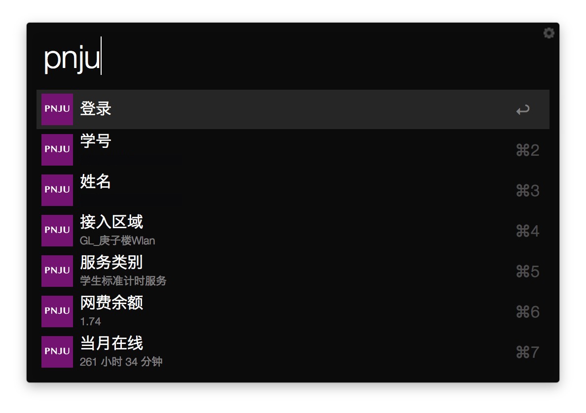

# PNJU-Workflow

An Alfred Workflow to Login PNJU.

> Be sure you have your Node.js / io.js installed.

## How To Use

Open `post.js` file and complete the `username` and `password`.

## Screenshot

## See Also

+ [Windows](https://github.com/miaoxw/Auto-p.nju)
+ [Mac](https://github.com/Cee/PNJU-TodayWidget)
+ [iOS &  Watch](https://github.com/Cee/PNJU-Watch)

## Dependency

+ Request
+ [Alfred-Item](https://github.com/XadillaX/alfred-item)

## License

This application is released under [GNU General Public License v2.0](http://www.gnu.org/licenses/gpl-2.0.html).
